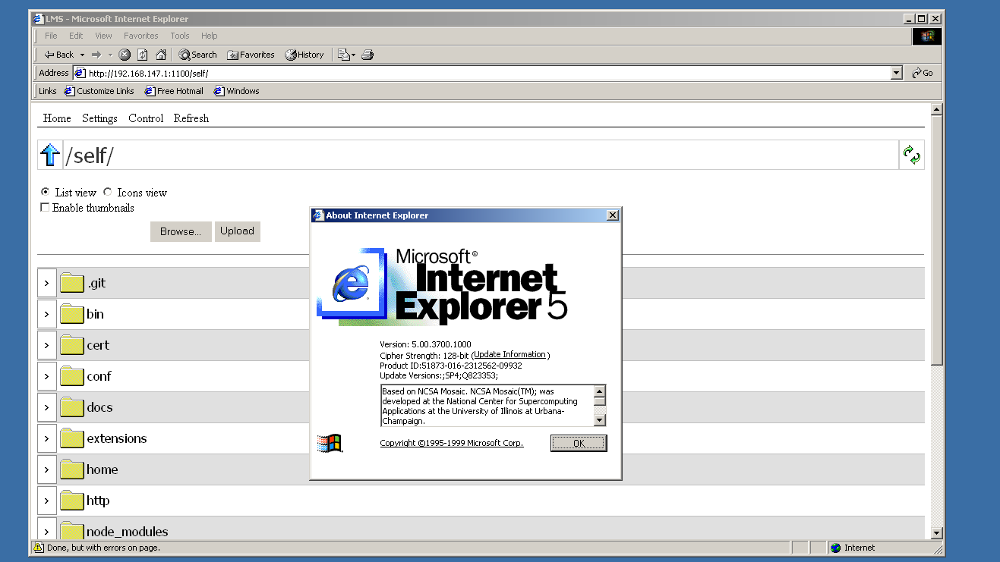

# Local Media Server

## :question: What is it?
**LMS** aims to provide a simple LAN file server for all browsers, including completely ancient ones. LMS allows downloading and uploading across the server's file system hosted in the user's machine or another machine.

More special interactivity is unlocked trough the use of JS and requires at least IE 5. However, basic media transfer capabilities will work even with JavaScript completely disabled.

It also comes with a custom HTML5 video player for web streaming over the local network. The player should be compatible with any modern web browser.
